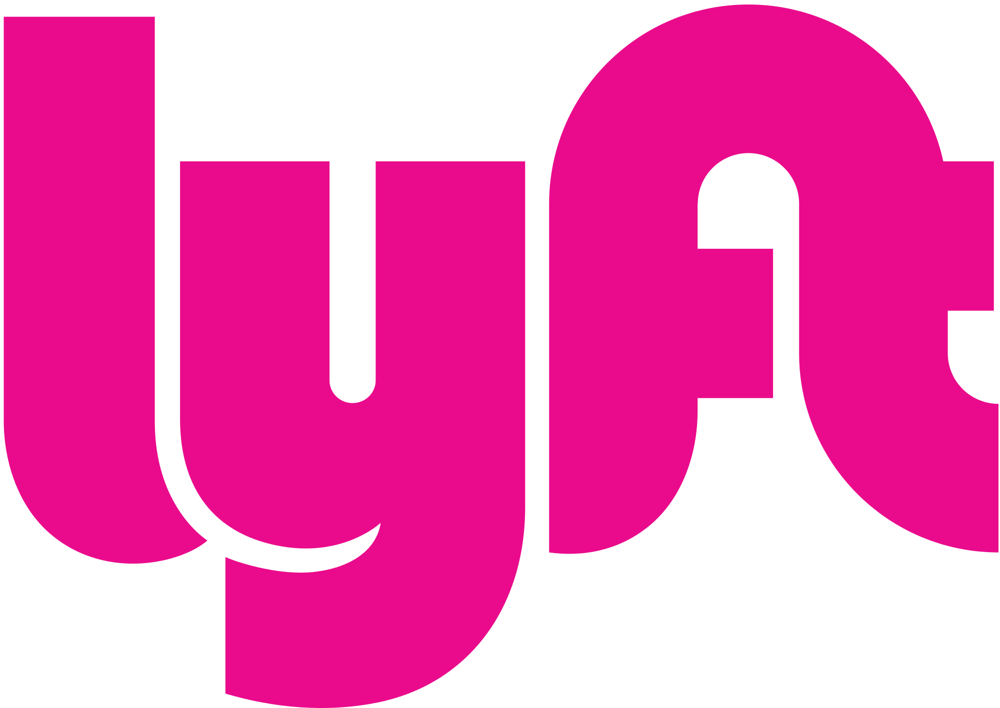

# Lyft

* **Track:** _Common Core_
* **Curso:** _Creando tu primer sitio web interactivo_
* **Unidad:** _Maquetado web con HTML & CSS_

***

Para completar este reto, hemos creado este repositorio boilerplate (plantilla
inicial) con todos los recursos que necesitas. Esto incluye imágenes y
estructura de carpetas y archivos donde colocarás tu código.

## Flujo de trabajo

1. Debes realizar un [**fork**](https://gist.github.com/ivandevp/1de47ae69a5e139a6622d78c882e1f74)
   de este repositorio.

2. Luego deberás **clonar** tu fork en tu máquina. Recuerda que el comando a usar
   es `git clone` y su estructura normalmente se ve así:

   ```bash
   git clone https://github.com/<nombre-de-usuario>/lyft.git
   ```

## Objetivo

El reto consiste en replicar el sitio de **Lyft**, este será el resultado
a lograr:


## Consideraciones

* Encontrarás un archivo base `index.html` en el cual deberás escribir la
  estructura de tu proyecto y enlazar tus archivos de estilos (CSS).

* En la carpeta `css` tendrás un archivo base `main.css` donde agregarás los
  estilos necesarios para tu proyecto:

* Dentro de la carpeta `assets` se encuentra la carpeta `images` donde
  encontrarás todas las imágenes necesarias para completar tu proyecto.

* Deberás **actualizar el archivo `README.md`** explicando el contenido de tu
  repositorio.

* Esta web utiliza la tipografía `Montserrat`.

* La paleta de colores puedes obtenerla inspeccionado el sitio original, pero
  para ganar tiempo, puedes usar los siguientes:

  - Botones, hover: `#FF00BF`
  - Fondo de `footer`: `#333447`
  - Título del formulario: `#352384`
  - Texto del formulario: `#728099`
  - Gradiente morado: `linear-gradient(#76278F, #2B1E66);`

* Para el footer, deberás tomar en cuenta que tiene un hover y se ve como en la
  siguiente imagen:

  

  Además, los íconos deberás obtenerlo de `Icomoon`.

* Para este reto, encontrarás ciertas cosas que probablemente aun no has visto
  en clase (formularios, videos de Youtube). No te preocupes, estamos seguros
  que los afrontarás con éxito, de igual forma aquí unos tips:

  - Estos son los videos de Youtube:
    * https://www.youtube.com/watch?v=fLSmUWOYpKw
    * https://www.youtube.com/watch?v=V7j8Aqxmbs8
    * https://www.youtube.com/watch?v=xj2VWLV0xCU
  - Para agregar los videos, averigua sobre la etiqueta `iframe`.
  - Para el formulario, revisa las etiquetas como `form` e `input`.

* Puedes ver el [sitio original](https://www.lyft.com/), sin embargo, su diseño
  ya ha cambiado en ciertas partes, así que tu fuente de verdad es la imagen que
  muestra el objetivo de este reto.

  > Nota: El sitio original tiene ciertos efectos y funcionalidades que
están fuera del alcance de este reto. Enfócate en obtener la maquetación
lo más parecido posible, usando lo aprendido en clase ;)

## A tener en cuenta

Este reto será evaluado sobre lo siguiente:

* Pixel perfect (replicar el diseño con exactitud)
* Estructura de carpetas y archivos
* Nombramiento de clases, id, etc
* Indentación
* Archivo `README.md` actualizado y correctamente redactado
* Uso de comentarios para hacer tu código más legible


<!DOCTYPE html>
<html lang="en">
<head>
  <meta charset="UTF-8">
  <title>lyft b y  - i c h i </title>
  <link href="https://fonts.googleapis.com/css?family=Rubik" rel="stylesheet">
  <link rel="stylesheet" href="css/main.css"> <!-- trabajo linkeado -->
</head>
<body>
  <div>
    <div id="logotipo">
      
    </div>
    <div class="primer-menu">
      <h3>Drive</h3>
      <h3>Explore</h3>
      <h3>Help</h3>
      <p>Log In</p>
    </div>
  </div>
  <div id="imagen-gif">
    
  </div>
  <div id="gradiente"></div>
  <div id="cuadrado-blanco">
    <div class="texto-cuadrado-blanco">
      <h1>TURN MILES</h1>
      <h1>INTO MONEY</h1>
      <h5>SING UP TO DRIVE WITH LYFT</h5>
      <h5>Phone Number</h5>
      <hr>
    </div>
    <div class="texto-2-cuadrado-blanco"> <h5>Become a Driver</h5>
      <h5><a href="#">Sing Up to Ride</a></h5>
    </div>
    <div class="texto-3-cuadrado-bl">
      <h6>Already applied? <<a href="#">Check the status of your application here.</a></h6>
      <h6>Earn money for inviting friends to drive.<a href="#">Learn more</a></h6>
    </div>
  </div>


  
</body>
</html>

-------------------------
}


#logotipo img{
  width: 65px;
  height: 46px;
}

.primer-menu h3{
  display: inline-block;
  margin:100px;
  font-family:'Rubik', sans-serif;
  font-size: 30px;
}

.primer-menu p{
    border: 2px solid #A75050;
  font-size: 40px;
  border-radius: 100px;

}

.imgaen-gif img{
  size: 100%;
}

#cuadrado-blanco{
  background-color: #D01717;
}

.texto-cuadrado-blanco h1{
  size: 20px;
}

hr{
  width:  390px;
}

#gradiente{
background: linear-gradient(#76278f,#2b1e66);
} 